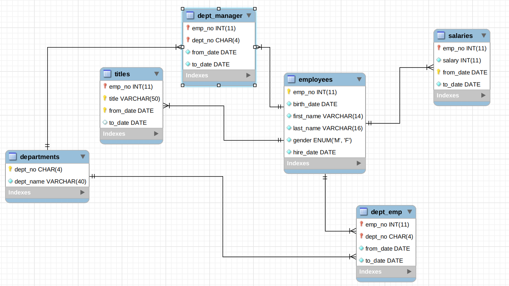

# Spring Batch In Action
This project is used for a Series of DZone Articles on Spring Batch with Spring Boot.  
the project uses an existing database provided by MySQL, you can check the documentation using this link : [test_db repo](https://github.com/datacharmer/test_db).

## Spring Batch With Job Parameters:
#### Overview:
in the first place we will show how to use Spring Batch - in a Spring Boot project -  with Job Parameters.
to do so we will create a batch job that select all the employees from the employees DB and write them to
2 different CSV files based on emp_no parity - whether the emp_no of an employee is odd or even.

#### Requirements:
<ul>
<li>Spring Boot.</li>
<Li>Spring Batch.</Li>
<li>MySQL</li>
</ul>
I am Using MySQL, but you can change it and uses an Embedded DB - H2 for example.

